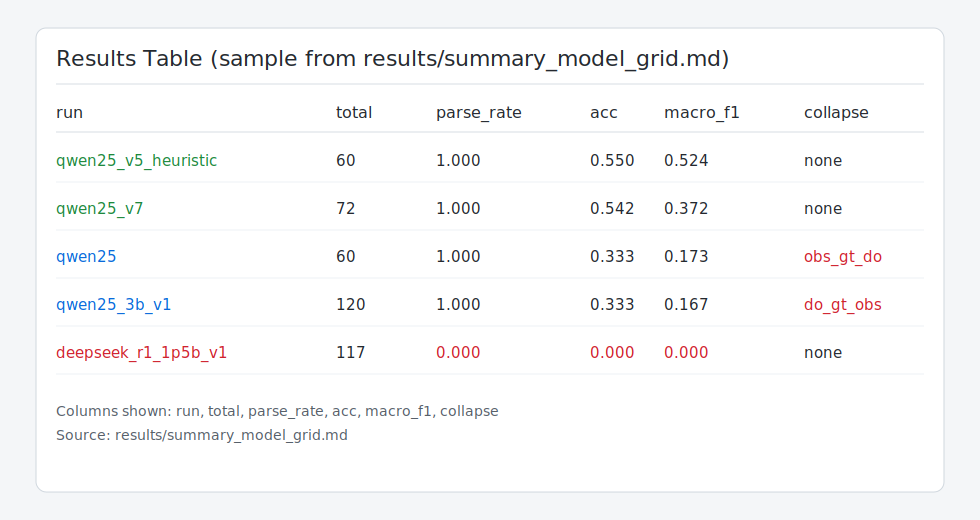

# causalbench-llm

See [`REPORT.md`](REPORT.md) for consolidated results and failure analysis.

## What It Is / Why It Matters
`causalbench-llm` is a synthetic benchmark for testing whether language models can reason causally, not just correlate.
It generates linear-Gaussian SCM instances with known structure and known ground-truth intervention effects.
Each prompt asks models to compare `P(Y>0 | X~1)` against `P(Y>0 | do(X=1))` under causal motifs that induce common reasoning traps.
Strict JSON output parsing plus deterministic scoring makes model behavior easy to compare and reproduce.
This matters because many real-world decisions depend on intervention-aware reasoning, not observational pattern matching.

## Prerequisites
- Python `3.12+`
- Choose one environment setup path:

```bash
# Option A (recommended): uv
pipx install uv

# Option B: pip/venv
python -m venv .venv && source .venv/bin/activate && pip install -e .
```

## Install + Run (3 commands)

```bash
uv sync
uv run python -m causalbench.eval.run_eval --backend hf --model-name "Qwen/Qwen2.5-0.5B-Instruct" --device cpu --n-instances 120 --seed 0 --scm-kinds all --balance-labels --stratify-motif-label --out-dir results/runs/dev
uv run python -m causalbench.eval.summarize results/runs/dev/results.jsonl --out-table results/runs/dev/results_table.md
```

If you use the `pip/venv` path above, run the same modules with `python -m ...` (without the `uv run` prefix).

## What's Inside

### SCM motifs
- confounding (`U -> X`, `U -> Y`, `X -> Y`)
- confounding-only (`U -> X`, `U -> Y`)
- no-confounding direct effect (`X -> Y`)
- mediation (`X -> M -> Y`)
- collider (`X -> Y`, `X -> Z`, `Y -> Z`)
- instrumental variable (`Z -> X -> Y`, `U -> X`, `U -> Y`)
- anti-causal (`Y -> X`, `U -> X`, `U -> Y`)
- backdoor-adjustable (`W -> X`, `W -> Y`, `X -> Y`)

### Metrics
- parse rate (strict JSON validity)
- overall accuracy and macro F1
- per-label recall for `obs_gt_do`, `do_gt_obs`, and `approx_equal`
- prediction mix and collapse detection
- difficulty and reliability buckets in summary reports

### Baselines
- Hugging Face local-model backend
- OpenRouter API-model backend
- non-LLM heuristic baseline: `python -m causalbench.eval.heuristic_baseline`

## Repo Map
- Fixed benchmark splits and metadata: `experiments/fixed_split_v1.jsonl`, `experiments/fixed_split_v1_meta.json`
- SCM graph + sampling logic: `src/causalbench/scm/`
- Task instance building and labels: `src/causalbench/tasks/`
- Main evaluation runner: `src/causalbench/eval/run_eval.py`
- Outputs and summaries: `results/runs/*`, `results/summary_model_grid.md`

## Expected Compute
- Typical local smoke run (`Qwen2.5-0.5B`, CPU): about `8-20` minutes for `120` instances on a modern laptop CPU.
- Larger runs (`240+` instances) or API-backed evaluations usually scale roughly linearly with instance count and model latency (often `15-40` minutes for `240` local-CPU instances).
- If you need a strict budget, start with `--n-instances 60` and scale up after verifying parse rate and throughput.
- Current checked-in results are compute-constrained and should be treated as indicative, not definitive.
- For more predictive and informative model comparisons, run larger fixed-split evaluations (for example `240-500+` instances per model).

## Example Results Table

Example from `results/runs/qwen05b/results_table.md`:

| label | n | acc |
|---|---:|---:|
| do_gt_obs | 10 | 1.000 |
| obs_gt_do | 13 | 0.000 |
| approx_equal | 7 | 0.000 |

Interpretation: this run gets `do_gt_obs` correct but fails `obs_gt_do` and `approx_equal`, suggesting a strong directional heuristic rather than stable causal discrimination.
This table is illustrative from a small run; larger sample sizes make the benchmark more predictive and informative of true model behavior.

## Screenshot (Results Table)



## Roadmap

### Implemented
- Multiple motifs (confounding, collider, mediation, IV, anti-causal, backdoor-adjustable, and more)
- Rejection sampling for balanced labels
- Strict JSON scoring and parse tracking
- CI coverage with `pytest` and `ruff`

### Planned
- Non-linear and discrete SCM families
- Calibration and confidence-aware scoring
- Fixed benchmark split packaging and leaderboard script
- Motif-specific prompts for explicit adjustment/selection reasoning

## Technical Note

See [`docs/technical_note.md`](docs/technical_note.md) for derivations, assumptions, and benchmark framing.
